# 图神经网络（GNN）课程实验报告

> 课程任务：基础知识学习 · 3. GNN ｜ 基于 DGL 框架

## 1. 任务概述

本实验围绕图上的机器学习任务，基于 **DGL（Deep Graph Library）** 完成四组实验，并覆盖 Node Embedding 三种经典模型、三种 GNN 架构以及不同池化策略：

| 实验 | 任务 | 数据集 | 评测指标 |
|---|---|---|---|
| 实验一 | Node Embedding · 链路预测（Link prediction） | Cora | AUC |
| 实验二 | Node Embedding · 节点分类（Node classification） | Cora | Accuracy |
| 实验三 | GNN · 半监督节点分类 | Cora | Accuracy |
| 实验四 | GNN · 图分类（Graph classification） | ENZYMES | Accuracy |

各实验均包含主实验、超参数实验与可视化分析；实验一额外包含 Embedding 的 t-SNE 降维可视化。

## 2. 实验环境

| 项目 | 配置 |
|---|---|
| 操作系统 | Windows 10（64 位） |
| Python | 3.12（conda 独立环境 `gnn`） |
| 深度学习框架 | PyTorch 2.3.0 (CPU) 、 DGL 2.2.1 |
| 科学计算库 | NumPy 1.26.4、SciPy、Scikit-learn、NetworkX、Matplotlib |

> 环境说明：DGL 2.2.1 的 Windows 轮子仅支持到 Python 3.12，且其预编译 C++ 库与 PyTorch 2.3.0 版本号对齐，因此单独创建 conda 环境以避免与现有 Python 3.13 环境冲突。数据集由 DGL 自动下载并缓存到项目 `data/` 目录。

## 3. 数据集介绍与可视化

实验一至三使用了三个经典的引文网络数据集（节点为论文，边为引用关系，标签为研究主题），实验四使用酶分子图数据集 ENZYMES。为直观了解数据，实验前对三个节点级数据集进行了统计与可视化。

### 3.1 数据集基本统计

| 数据集 | 节点数 | 边数（有向） | 特征维 | 类别数 | 训练/验证/测试节点 |
|---|---|---|---|---|---|
| Cora | 2708 | 10556 | 1433 | 7 | 140 / 500 / 1000 |
| Citeseer | 3327 | 9228 | 3703 | 6 | 120 / 500 / 1000 |
| Pubmed | 19717 | 88651 | 500 | 3 | 60 / 500 / 1000 |

> 注：Pubmed 图中存在孤立节点，实验三在加载时统一添加自环以配合 GCN 的度归一化，故统计中的边数含自环；原始有向边为 88651 条。

三个数据集均为**小样本半监督**设定：每类仅有 20 个训练标签（Cora 140、Citeseer 120、Pubmed 60），但整张图的结构（近万至十万条边）与节点特征可作为监督信号的补充。

### 3.2 数据集可视化

以 Cora 为例（其余两个数据集的可视化见 `result/` 目录）：

- **标签分布**：7 个类别节点数量分布；
- **节点度分布**：近似幂律分布（少数节点拥有极高连接度）；
- **特征 t-SNE**：节点的高维特征降维后按标签着色，可观察到同主题论文在特征空间中的聚类结构；
- **子图拓扑**：随机采样的连通子图，节点按标签着色，可见引文网络的社区结构。

| Cora 特征 t-SNE | Cora 子图拓扑 | Citeseer 特征 t-SNE | Pubmed 特征 t-SNE |
|---|---|---|---|
| 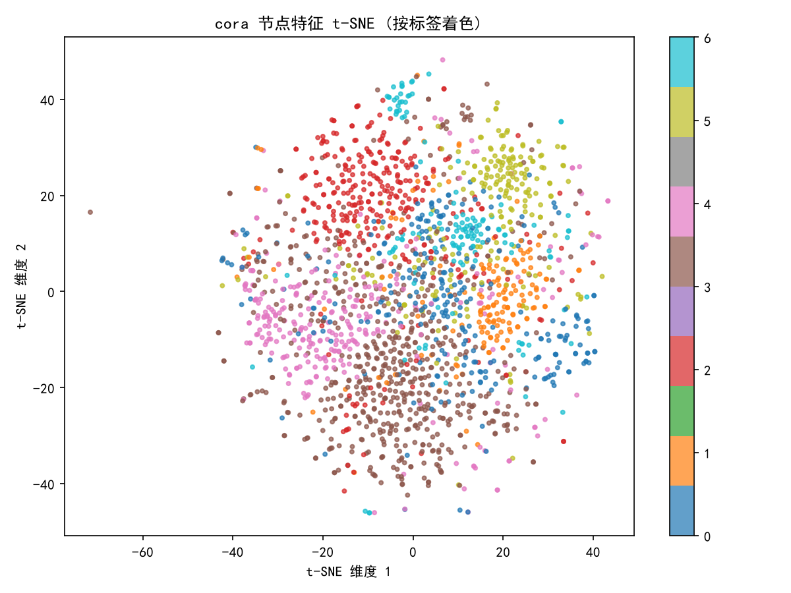 | 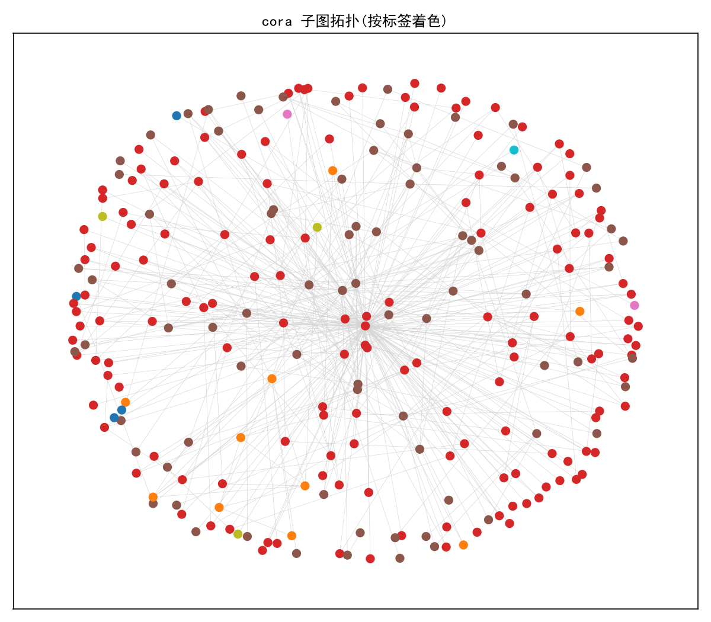 | 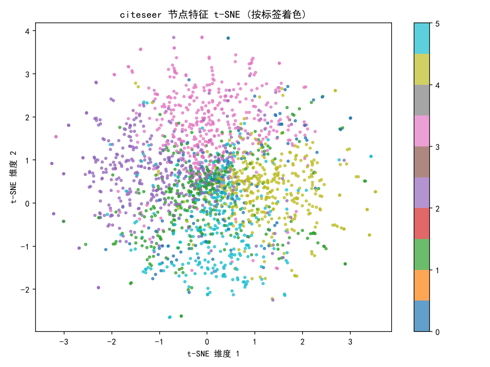 | 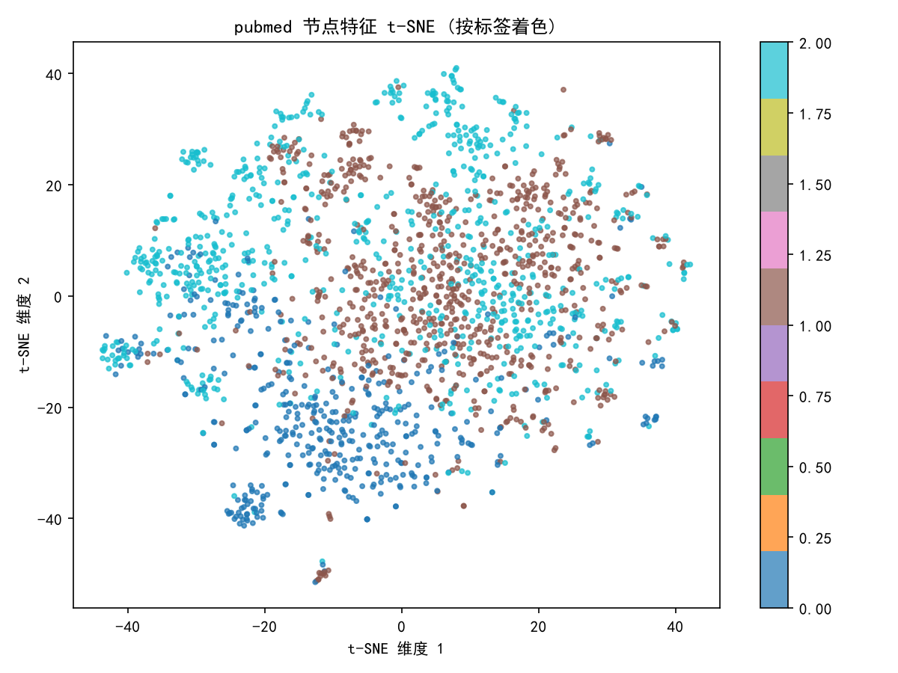 |

从 t-SNE 图可以看出：特征空间内同类节点倾向于聚集，这为后续基于图结构 + 特征的半监督学习提供了基础。

## 4. 理论知识

### 4.1 Node Embedding 三种经典模型

Node Embedding 的目标是把每个节点映射为低维稠密向量 $\mathbf{z}_v \in \mathbb{R}^d$，使向量空间中的相似度反映图结构中的邻近性。其学习方式可分为两类：**基于随机游走的序列建模**（DeepWalk、node2vec）与**基于边近似的显式优化**（LINE）。

#### 4.1.1 DeepWalk

**核心思想**：把图上的节点当作"词"，把随机游走产生的节点序列当作"句子"，从而把词嵌入（Word2Vec）方法迁移到图结构上。

**建模过程**：

1. **随机游走**：从每个节点 $v$ 出发按均匀概率随机选取邻居，生成固定长度 $T$ 的游走序列。
2. **Skip-gram 建模**：对每条游走序列，最大化给定中心节点 $v$ 时窗口 $w$ 内上下文节点 $c$ 出现的条件概率：
   $$
   \max \sum_{v \in V} \sum_{c \in \text{context}(v)} \log P(c \mid v), \qquad
   P(c \mid v) = \frac{\exp(\mathbf{z}_c^\top \mathbf{z}_v)}{\sum_{u \in V} \exp(\mathbf{z}_u^\top \mathbf{z}_v)}.
   $$
3. **负采样近似**：分母对全体节点求和代价过高，实际使用负采样（Negative Sampling）：
   $$
   \mathcal{L} = -\log \sigma(\mathbf{z}_c^\top \mathbf{z}_v) - \sum_{k=1}^{K} \mathbb{E}_{u_k \sim P_n} \log \sigma(-\mathbf{z}_{u_k}^\top \mathbf{z}_v).
   $$

**核心建模思想**：局部窗口内的共现节点应具有相近的表示，等价于保留图的多阶邻近性。

#### 4.1.2 LINE

**核心思想**：不依赖随机游走，直接在边上采样，显式优化两种"邻近性"。

- **一阶邻近性**（直接相连的节点表示相近）：
  $$
  \mathcal{L}_1 = -\log \sigma(\mathbf{z}_u^\top \mathbf{z}_v) - \sum_{k=1}^{K} \mathbb{E}_{u_k \sim P_n} \log \sigma(-\mathbf{z}_{u_k}^\top \mathbf{z}_v).
  $$
- **二阶邻近性**（拥有相似邻居的节点相似）：每个节点 $i$ 有两套表示——中心 embedding $\mathbf{z}_i$ 与上下文 embedding $\mathbf{z}_i'$，
  $$
  \mathcal{L}_2 = -\log \sigma(\mathbf{z}_u^\top \mathbf{z}_v') - \sum_{k=1}^{K} \mathbb{E}_{u_k \sim P_n} \log \sigma(-\mathbf{z}_u^\top \mathbf{z}_{u_k}').
  $$

**核心建模思想**：一阶刻画"直接相连"，二阶刻画"共享邻居"，两者互补，可扩展到大图。

#### 4.1.3 node2vec

**核心思想**：在随机游走中加入参数 $p$、$q$ 控制游走倾向，在**广度优先**（BFS，结构等价）与**深度优先**（DFS，同质/社区）之间平滑插值。设上一步从 $t$ 走到 $v$，则下一步选择 $x$ 的概率为：
$$
P(x \mid v) \propto
\begin{cases}
1/p & d_{tx} = 0 \text{（回到 } t \text{）}\\
1   & d_{tx} = 1\\
1/q & d_{tx} = 2
\end{cases}
$$
$p$ 小→偏回溯（BFS），$q$ 小→偏远离（DFS）。游走序列仍用 Skip-gram + 负采样训练。

#### 4.1.4 三种模型的异同

| 维度 | DeepWalk | node2vec | LINE |
|---|---|---|---|
| 建模方式 | 均匀随机游走 + Skip-gram | 有偏随机游走 + Skip-gram | 显式优化一阶/二阶邻近损失 |
| 是否用游走 | 是 | 是 | 否（直接采样边） |
| 捕捉的邻近性 | 多跳路径共现 | 多跳共现（可调偏向） | 一阶/二阶显式 |
| 关键超参 | 游走长度、游走数 | 游走长度、$p,q$ | 损失阶数、负样本数 |

三者都依赖"邻近节点表示相近"的局部性假设，差别在于**如何定义邻居**（游走共现 vs 直接边）以及**是否有游走偏向**。

### 4.2 GNN 基础与不同邻居聚合机制

GNN 通过**消息传递**逐层更新节点表示：第 $\ell$ 层，节点聚合邻居信息并融合自身信息：
$$
\mathbf{h}_v^{(\ell+1)} = \text{UPDATE}\left(\mathbf{h}_v^{(\ell)}, \text{AGGREGATE}\left(\{\mathbf{h}_u^{(\ell)}: u \in \mathcal{N}(v)\}\right)\right).
$$

- **GCN**：对称归一化的邻居特征加权求和（矩阵形式为 $\hat{\mathbf{D}}^{-\frac12}\hat{\mathbf{A}}\hat{\mathbf{D}}^{-\frac12}\mathbf{H}\mathbf{W}$），权重由度预先定义。
- **GAT**：为每条边学习**注意力系数**，聚合时按注意力加权；多头注意力增强稳定性，权重由数据自适应学习。
- **GraphSAGE**：**采样**固定数量邻居后用可学习聚合器（Mean/Pool/LSTM）聚合，可与自身特征拼接后非线性变换；**归纳式**，可泛化到新图。

**异同小结**：三者都是"邻居聚合 + 自身融合"的消息传递框架；差异在于邻居权重的来源（度归一化 vs 注意力 vs 采样聚合）、是否采样、以及能否泛化到新图。

### 4.3 Pooling 策略（图级别读出）

图分类需要把节点表示"读出"为整图表示：

- **全局平均/求和/最大池化（Mean / Sum / Max Pooling）**：对全部节点表示做逐维统计，简单高效、无参数，但忽略图的层级结构。任务中的 AveragePooling 与 MeanPooling 数学上等价（即全局平均池化）。
- **DiffPool（可微分池化）**：学习分配矩阵 $\mathbf{S} \in \mathbb{R}^{N \times K}$ 将 $N$ 个节点软分配到 $K$ 个簇（超节点）：
  $$
  \mathbf{S} = \text{softmax}(\text{GNN}_{\text{assign}}(\mathbf{A},\mathbf{X})),\quad
  \mathbf{Z} = \text{GNN}_{\text{embed}}(\mathbf{A},\mathbf{X}),
  $$
  $$
  \mathbf{X}' = \mathbf{S}^\top \mathbf{Z},\quad
  \mathbf{A}' = \mathbf{S}^\top \mathbf{A} \mathbf{S},
  $$
  附带辅助损失 $\|\mathbf{A}'\|_F + \lambda H(\mathbf{S})$ 促进分配矩阵"硬"且贴合原图结构。能学习**层级化、与任务相关的池化**，但参数多、训练成本高，对中小图优势不明显。

### 4.4 半监督节点分类任务

给定 $G=(V,X,A,Y)$，仅部分节点有标签，利用图结构与特征为无标签节点预测标签。训练损失只作用于有标签节点，通过消息传递让**有标签信息沿边传播**。任务核心是"标签在图上平滑"的同质假设与直推/归纳两种设定。

### 4.5 Node classification 与 Graph classification 的异同

| 维度 | 节点分类 | 图分类 |
|---|---|---|
| 预测单元 | 单个节点 | 整张图 |
| 标签粒度 | 节点级 | 图级 |
| 读出方式 | 节点自身表示 | 节点表示 → **图池化** → 图表示 |
| 数据组织 | 一张大图，按节点划分 | 多个图，按**图**划分 |
| 消息传递 | 跨训练/测试节点共享图 | 每张图独立 |

两者都依赖消息传递学习表示；本质区别是分类对象是节点还是图，图分类必须经过"图读出"（池化）。

## 5. 实验一：Node Embedding · 链路预测（Link prediction）

### 5.1 实验设计

- **数据集**：Cora。使用 `dgl.data.CoraGraphDataset()` 加载。
- **边划分**：将图中 10% 的边作为测试正边，随机采样等量不存在的节点对作为测试负边；剩余 90% 边用于训练（并从训练图中移除测试边），再对训练边采样等量负边。
- **Embedding 训练**：统一 128 维。
  - DeepWalk：`dgl.sampling.random_walk()` 生成均匀随机游走（默认每节点 10 条、长度 40），自实现 Skip-gram + 负采样；
  - node2vec：`dgl.sampling.node2vec_random_walk()` 生成有偏游走（默认 $p=q=1$），同样的 Skip-gram 训练器；
  - LINE：直接采样训练图上的边，分别用一阶/二阶损失 + 负采样训练。
- **评测**：以节点 embedding 的内积作为边得分，用 AUC 衡量正负边排序能力，分别评测训练集与测试集。
- **超参实验**：DeepWalk（路径长度 {20,40,80}、每节点路径数 {5,10,20}）、node2vec（$(p,q)$ 共 5 组）、LINE（一阶/二阶、负样本数 {1,5,10}）。
- **可视化**：对三个模型的 embedding 做 t-SNE 降维并按类别着色。

### 5.2 主实验结果

| 模型 | 训练集 AUC | 测试集 AUC | 训练−测试 |
|---|---|---|---|
| DeepWalk | 0.9475 | 0.9139 | +0.0336 |
| node2vec | 0.9472 | 0.9102 | +0.0370 |
| LINE（二阶） | 0.8178 | 0.7607 | +0.0571 |

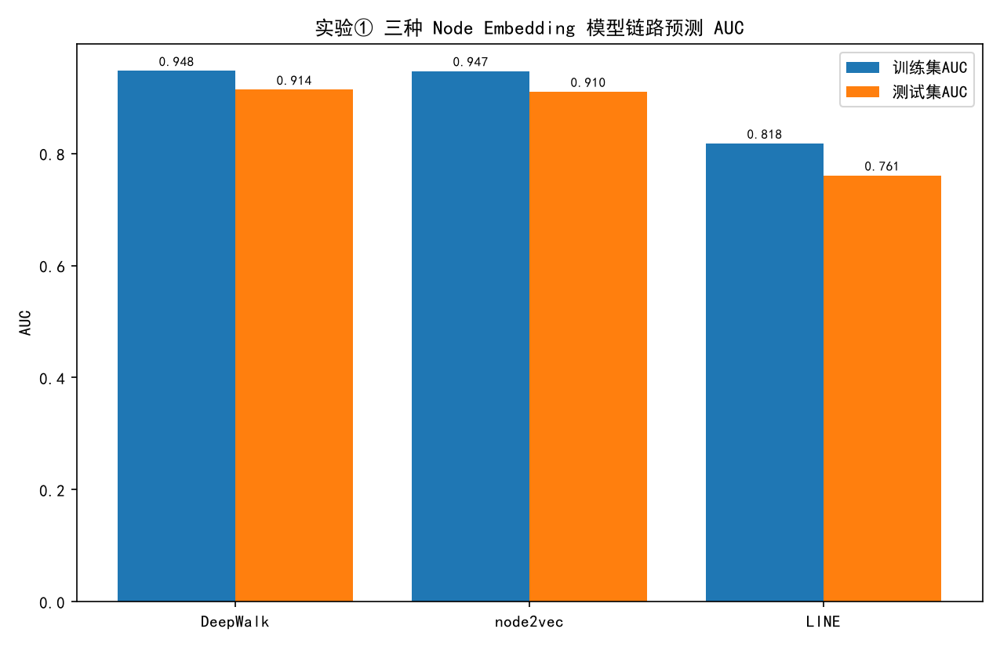

**分析**：
- 三种模型测试 AUC 均明显高于随机水平 0.5，说明 Node Embedding 确实编码了图的结构信息。
- **DeepWalk 与 node2vec 表现接近且最好**（测试 AUC ≈ 0.91）。Cora 是强同质（homophily）的引文网络，多跳随机游走捕捉的高阶结构对链路预测最有利。
- **LINE（二阶）相对较弱**（0.76）。LINE 只建模一/二阶邻近，捕捉的全局结构信息少于随机游走类方法；且其训练目标是显式的边级损失，与"用内积打分"的评测方式不完全对齐。
- 各模型训练集 AUC 均高于测试集，属于正常的泛化差距；LINE 差距最大，说明其在训练边上的拟合对未见边的泛化较弱。

### 5.3 超参数实验

| 模型 | 超参 | 取值 → 测试 AUC |
|---|---|---|
| DeepWalk | 路径长度 | 20 → 0.9487 ｜ 40 → 0.9311 ｜ 80 → 0.9127 |
| DeepWalk | 每节点路径数 | 5 → 0.9502 ｜ 10 → 0.9312 ｜ 20 → 0.9131 |
| node2vec | $(p,q)$ | (0.25,4) → 0.9483 ｜ (1,1) → 0.9309 ｜ (4,0.25) → 0.9225 |
| LINE | 损失阶数 | 一阶 → 0.9586 ｜ 二阶 → 0.7607 |
| LINE | 负样本数 | 1 → 0.7599 ｜ 5 → 0.7607 ｜ 10 → 0.7594 |

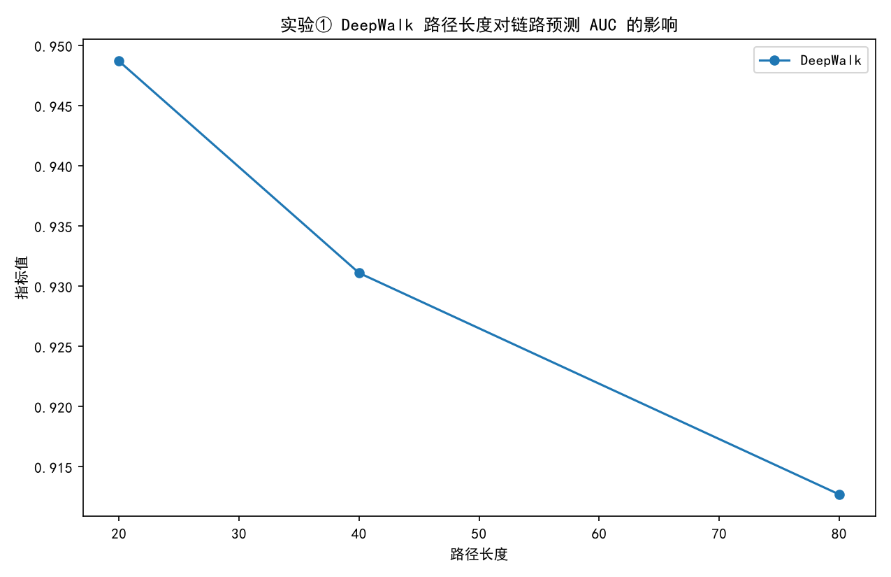　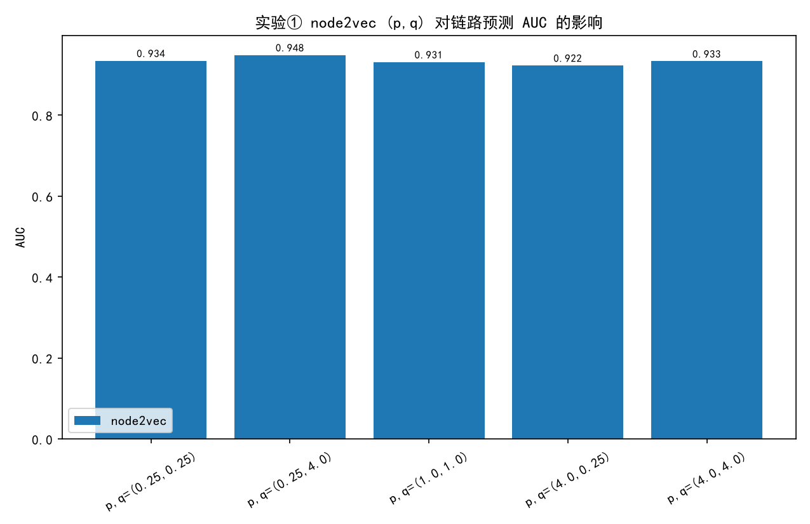　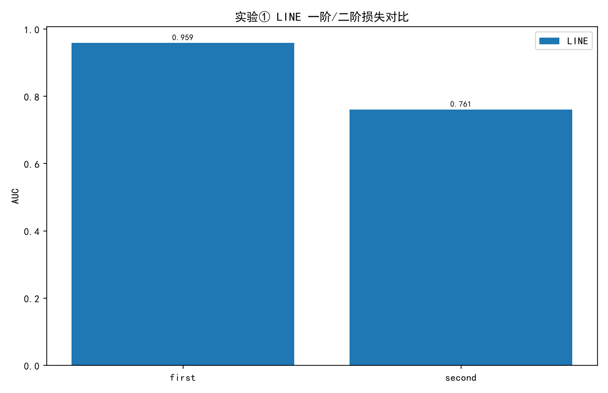

**分析**：
- **DeepWalk：更短的路径（20）与更少的游走（5）反而更好**。游走越长、条数越多，产生大量相隔多跳的弱相关上下文对，在固定训练轮数下稀释了有效信号。
- **node2vec：$q=4$（偏 DFS/同质）时最好**（0.9483），$(p,q)=(0.25,4)$ 优于 $p=q=1$，说明在 Cora 上偏重同质性的游走更有利；$p$ 小（偏 BFS）时（0.9225）较差。
- **LINE：一阶损失远优于二阶**（0.9586 vs 0.7607）。因为链路预测用内积直接衡量"两个节点直接相连"的强度，与一阶损失的目标天然一致；而二阶中心 embedding 与评测方式错位。一阶 LINE 甚至超过了 DeepWalk/node2vec，说明在"预测边是否存在"这一任务上，直接优化一阶邻近是最对口的。
- **负样本数量对二阶 LINE 影响很小**（0.76 附近）。

### 5.4 t-SNE 可视化

| DeepWalk | node2vec | LINE |
|---|---|---|
| 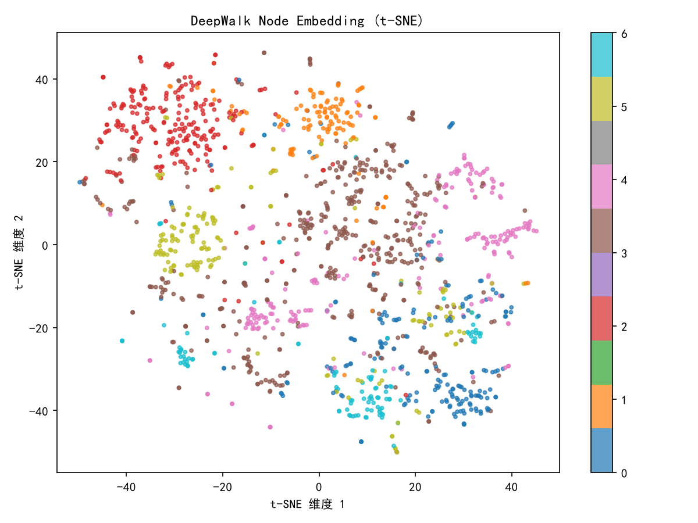 | 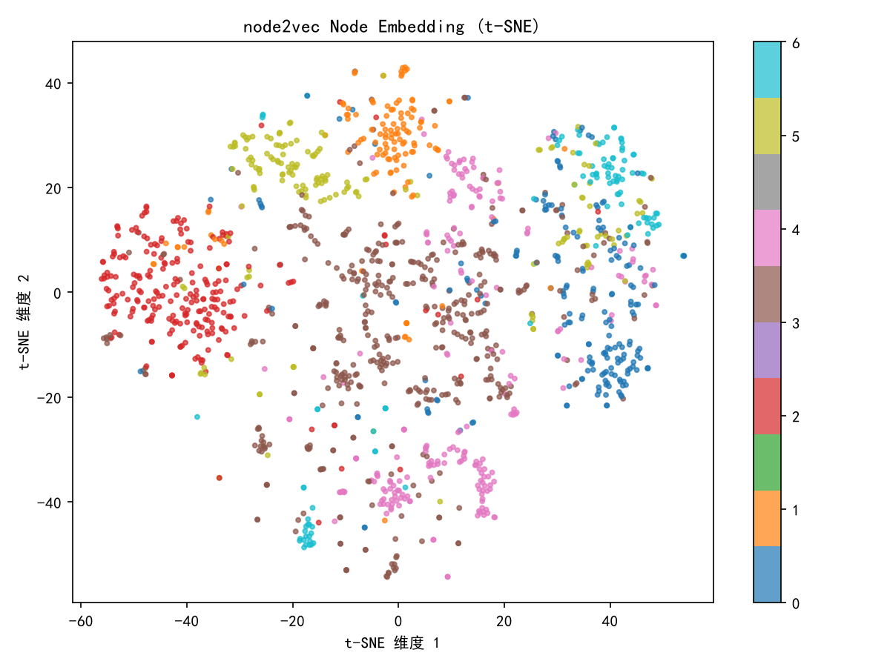 | 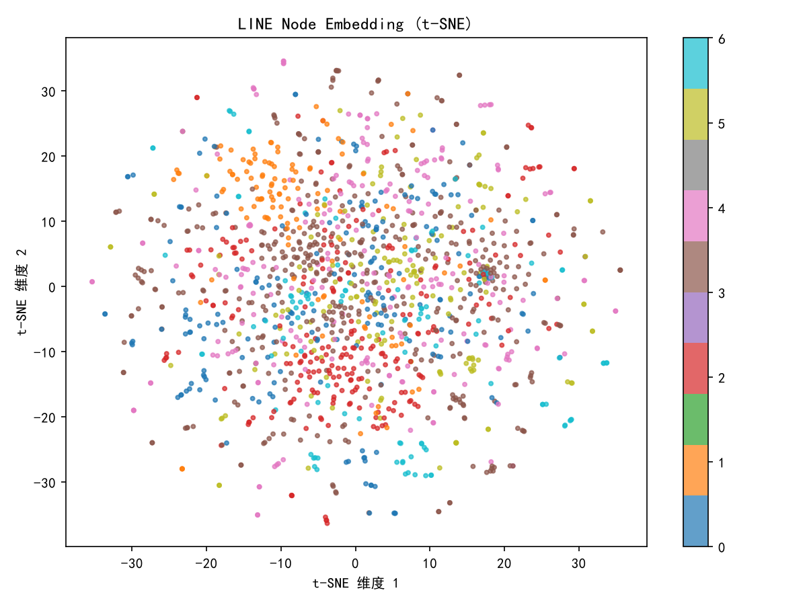 |

三个模型的 embedding 经 t-SNE 降维后，同类别节点均呈现明显的簇状聚集，且 DeepWalk / node2vec 的簇更紧致、边界更清晰，与数值结果一致；LINE 的簇相对松散，与其较弱的表示能力对应。

## 6. 实验二：Node Embedding · 节点分类（Node classification）

### 6.1 实验设计

- 在**整个图**上训练 DeepWalk / node2vec / LINE 得到节点 embedding（与实验一相同的训练器与默认超参）。
- 将有标签节点按 8:2 划分训练/测试集（分层抽样）。
- 用训练集节点的 embedding 与标签训练多分类器，在测试集上评测 **Accuracy**。
- 超参实验：① 不同种类的多分类器（Logistic / MLP-1 层 / MLP-2 层）；② 与实验一相同的 embedding 超参扫描。

### 6.2 主实验结果（默认 MLP-1 层分类器）

| Embedding 模型 | 训练集 Acc | 测试集 Acc |
|---|---|---|
| DeepWalk | 1.0000 | 0.8247 |
| node2vec | 1.0000 | 0.8247 |
| LINE | 1.0000 | 0.5498 |

### 6.3 不同分类器的对比（测试集 Acc）

| 分类器 | DeepWalk | node2vec | LINE |
|---|---|---|---|
| Logistic | 0.8118 | 0.8007 | 0.5221 |
| MLP-1 层 | 0.8247 | 0.8247 | 0.5498 |
| MLP-2 层 | 0.8321 | 0.8137 | 0.5461 |

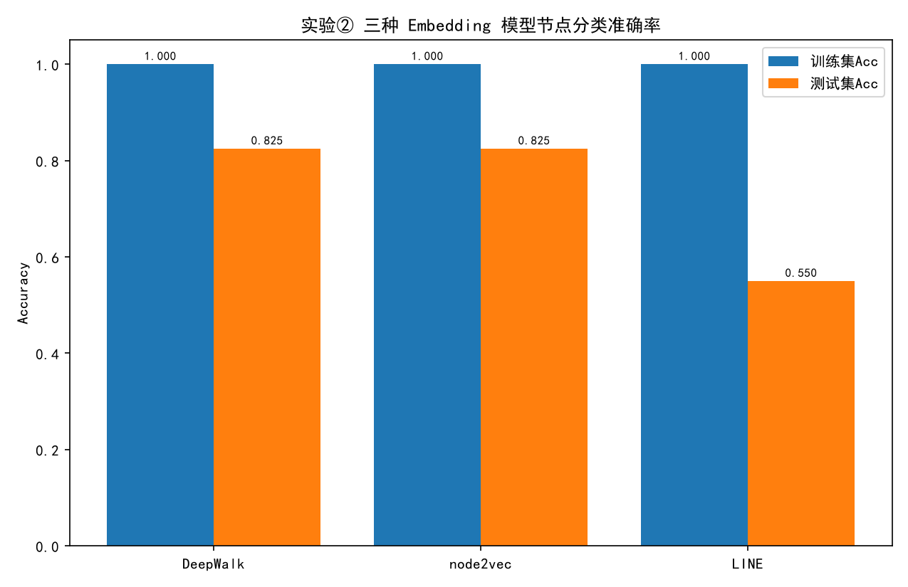

**分析**：
- **DeepWalk / node2vec 明显优于 LINE**（0.82 vs 0.55）。节点分类需要节点表示区分"语义类别"，随机游走捕捉的多跳结构更好地反映了引文网络的主题社区；LINE 的局部邻近表示区分度不足。
- 三种分类器对同一 embedding 的结果接近（Logistic 略低、MLP 略高），说明在 128 维 embedding 上线性分类已能较好工作；MLP 的增益有限。DeepWalk 用 MLP-2 层达到最高 0.8321。
- 训练 Acc 均为 1.0（分类器可记忆训练样本），测试 Acc 反映 embedding 的泛化质量。

## 7. 实验三：GNN 半监督节点分类

### 7.1 实验设计

- 加载 Cora 的**节点属性与标签**，使用 DGL 自带的 train/val/test 节点划分（140/500/1000）。
- 使用 `dgl.nn` 下的 `GraphConv`、`GATConv`、`SAGEConv` 搭建 2 层模型（隐层 32 维），仅用训练节点标签计算交叉熵损失，用验证集早停，评测测试集 Accuracy。
- 为配合 GCN 的度归一化，统一对图添加自环。
- 超参实验：GNN 层数 {1,2,3}。

### 7.2 主实验结果（2 层）

| 模型 | 训练集 Acc | 测试集 Acc |
|---|---|---|
| GCN | 0.9786 | 0.8100 |
| GAT | 0.9714 | 0.8010 |
| GraphSAGE | 1.0000 | 0.8010 |

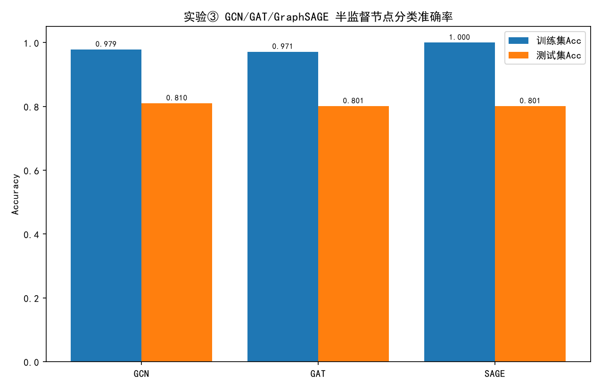

**分析**：
- 三个模型在仅有 140 个训练标签的情况下均达到约 **0.80 的测试准确率**，显著高于直接只用特征做监督分类，说明图结构信息的消息传递对半监督学习至关重要。
- GCN 略优于 GAT 与 GraphSAGE（0.810）。在 Cora 这样同质性强的图上，度归一化的简单加权求和已经足够有效；GAT 的注意力与 SAGE 的采样在如此小的图上收益有限。
- 训练集 Acc 很高（0.97–1.0），存在一定过拟合，但通过验证集早停控制了测试损失。

### 7.3 层数超参数实验（测试集 Acc）

| 层数 | GCN | GAT | GraphSAGE |
|---|---|---|---|
| 1 | 0.8130 | 0.7430 | 0.7770 |
| 2 | 0.8220 | 0.8060 | 0.8030 |
| 3 | 0.8190 | 0.8020 | 0.8030 |

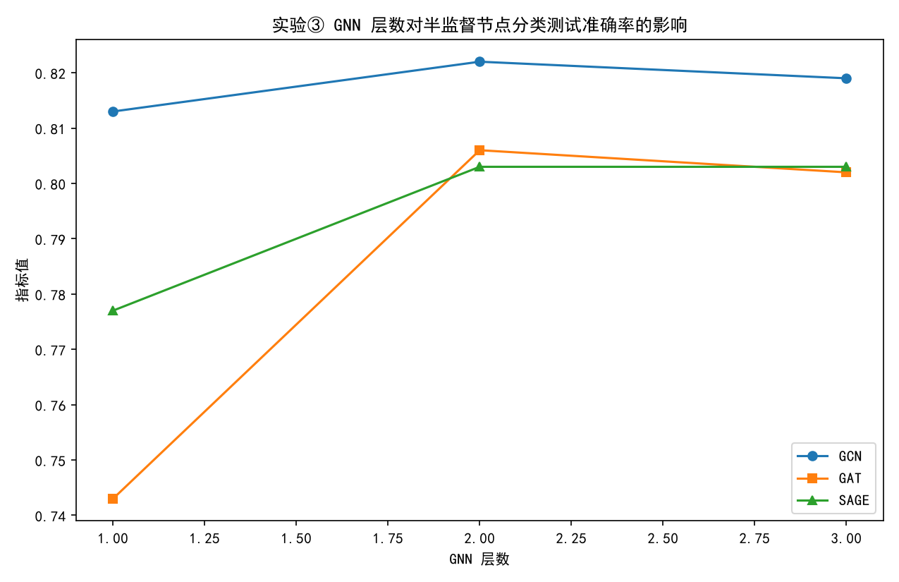

**分析**：
- 各模型在 **2 层时达到最优**（GCN 0.822、GAT 0.806、SAGE 0.803）。
- 1 层时感受野不足（仅一阶邻居），2 层覆盖两阶邻居；**3 层时出现轻微下降**——小图上叠加过多消息传递层会导致"过平滑"（over-smoothing），节点表示趋于同质。

## 8. 实验四：GNN 图分类（Graph classification）

### 8.1 实验设计

- **数据集**：ENZYMES（600 个酶分子图，6 类），节点带 18 维属性。图按 8:2 划分训练/测试（分层）。
- 模型组合：GCN / GAT 作为骨干，配 **全局均值池化（MeanPool，即任务中的 AveragePooling）** 与 **DiffPool** 可微分池化。
- 评测 Accuracy；超参实验为 GNN 层数 {1,2,3}。
- 说明：DGL 的 GINDataset 捆绑包不含 ENZYMES，故从 TU 基准数据集官网单独下载并自建加载器；DiffPool 依据论文原意手写实现（含分配网络、粗化邻接与辅助损失），并做了数值稳定性处理（节点特征归一化、簇加权平均、全局跳跃连接）。

### 8.2 主实验结果（2 层）

| 模型 | 训练集 Acc | 测试集 Acc |
|---|---|---|
| GCN + MeanPool | 0.4479 | 0.3833 |
| GAT + MeanPool | 0.6229 | 0.5000 |
| GCN + DiffPool | 0.3625 | 0.3833 |

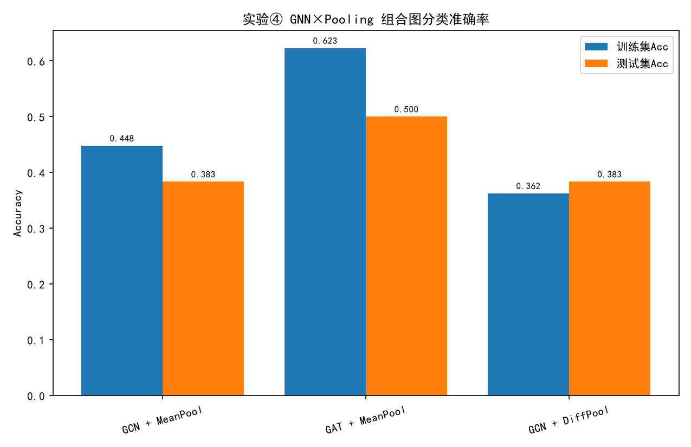

**分析**：
- **GAT + MeanPool 明显最佳（0.50）**。ENZYMES 是难度较高的图分类基准（6 类，随机基线 0.167），注意力机制在图级任务上比 GCN 更强的判别力在此体现。
- GCN + MeanPool 与 GCN + DiffPool 测试准确率相近（0.383）。**在 ENZYMES 这样节点数很少（平均约 32 个节点）的小图上，DiffPool 的层级池化优势无法发挥**——可微分池化的价值主要体现在大型、层级结构明显的图上；在小图上，简单的全局均值池化已经足够且更稳定。
- GAT 训练/测试差距较大（0.62/0.50），表明注意力模型拟合能力强但泛化受限于数据规模。

### 8.3 层数超参数实验（测试集 Acc）

| 层数 | GCN + MeanPool | GCN + DiffPool |
|---|---|---|
| 1 | 0.3667 | 0.3833 |
| 2 | 0.4000 | 0.3917 |
| 3 | 0.3917 | 0.3833 |

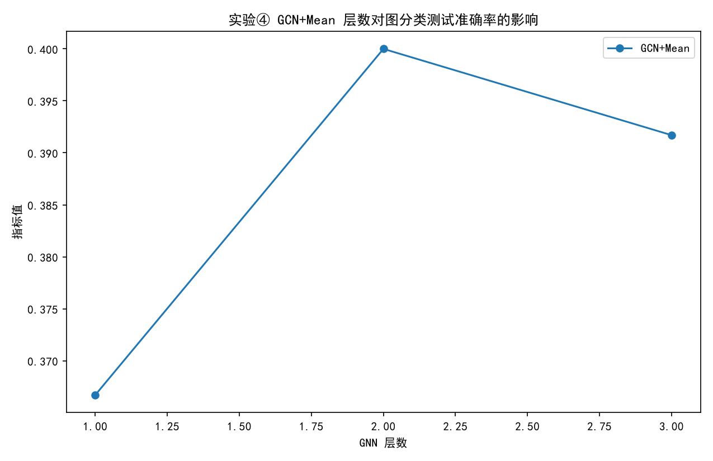　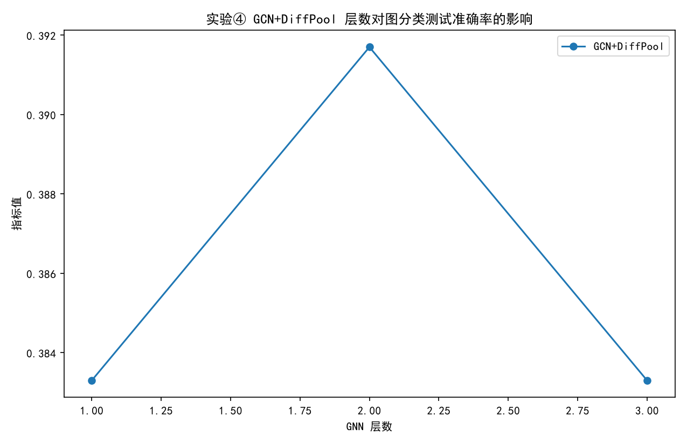

**分析**：两者均在 2 层达到最优，3 层略有回落，与实验三的结论一致——图太小，过深的消息传递无益。

## 9. 总结

1. **Node Embedding 三模型**：DeepWalk 与 node2vec 在 Cora 的链路预测（AUC≈0.91）与节点分类（Acc≈0.82）上都显著优于 LINE；但 LINE 一阶损失在"直接预测边是否存在"时反而最强（AUC 0.9586），说明**模型的选择应与任务目标对齐**。随机游走的超参（路径长度、条数、$p,q$）对结果有明显影响，实验中发现适度偏短、偏 DFS 的配置更优。
2. **GNN 架构**：GCN / GAT / GraphSAGE 在半监督节点分类上表现接近（Acc≈0.80），GCN 略优；在 ENZYMES 图分类上 GAT 明显更好。不同聚合机制的差异在数据规模较大、结构较复杂时更显著。
3. **池化策略**：MeanPool 简单高效；DiffPool 虽具层级表达力，但在小图上收益有限甚至略逊，其优势需在更大规模图上体现。任务中 AveragePooling 与 MeanPooling 数学等价。
4. **半监督与任务差异**：消息传递使仅 140 个标签即可达到 0.81 的准确率，验证了"标签沿图传播"的核心思想；节点分类与图分类的根本区别在于是否需要"图读出"环节。
5. **层数选择**：四个实验一致表明 2 层 GNN 为最优，更深会在小图上引发过平滑。

**可改进方向**：① LINE 二阶增加训练轮数与更好的负采样分布以逼近其最佳表现；② DiffPool 在更大数据集（如 REDDIT、PROTEINS）上验证；③ 引入 BatchNorm、dropout 调优与更强的分类头以进一步提升图分类性能。

---

*（实验代码见 `code/`，全部结果表格与图表见 `result/`，数据集缓存见 `data/`。）*
